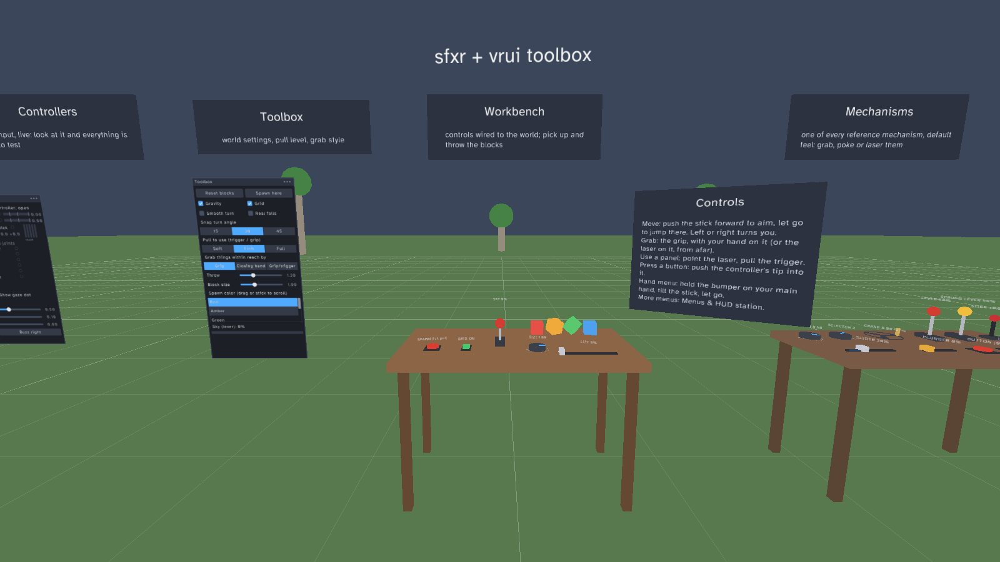
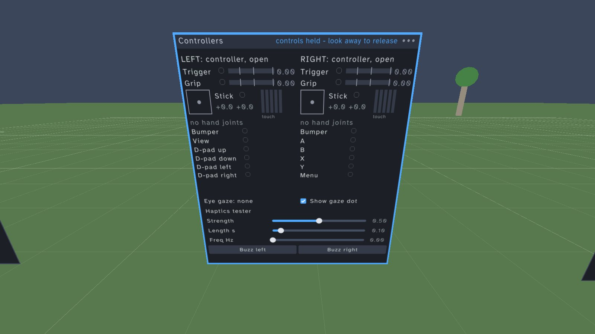
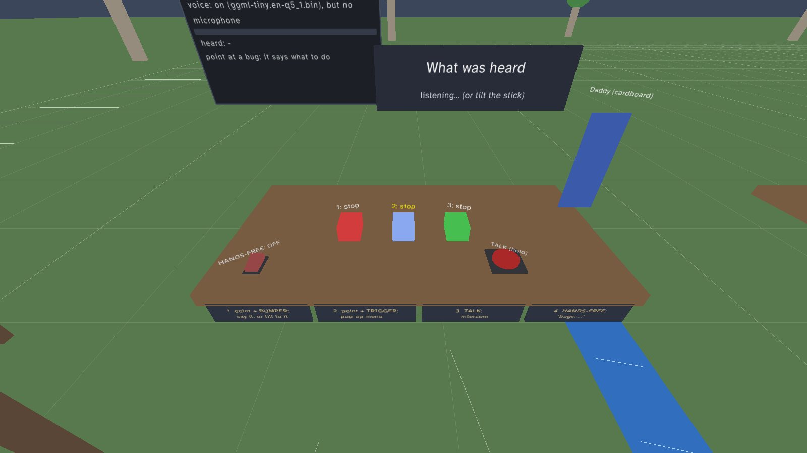
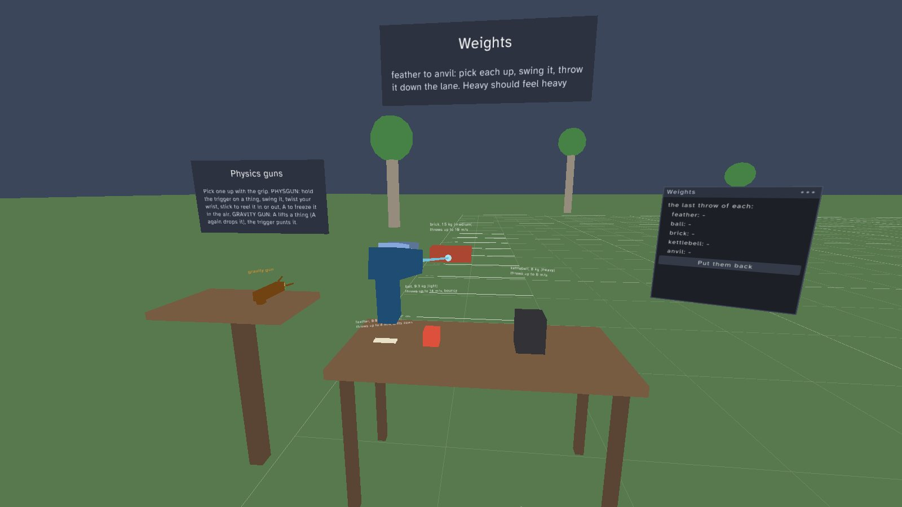
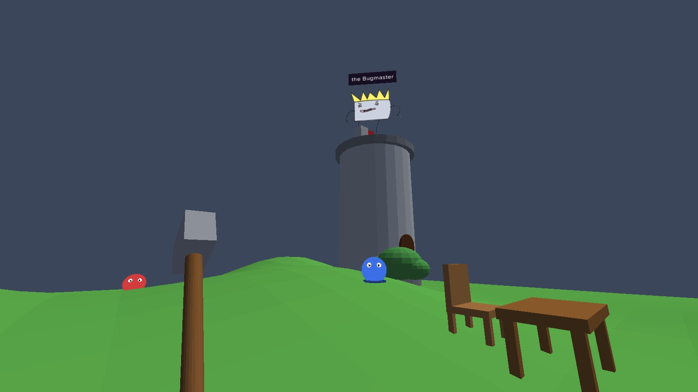

# Steam Frame × raylib × C: quickstart

Make native VR apps for the **Valve Steam Frame** headset in plain **C** with
**[raylib](https://www.raylib.com) 6.0**.

This is a quickstart, not a framework or a game. It's a set of small, readable
libraries, reference implementations and tools. Copy what you need; the flow of your
app is up to you.

```c
while (sfxr_frame_begin()) {                 // one loop iteration = one headset frame
    vrui_begin();
        if (vrui_push_button(1, button_pose, 0.04f, RED, "GO")) launch();
        vrui_knob(2, knob_pose, 0.035f, &volume, 0, 1, 0.75f, "VOLUME");
        vrui_grabbable(3, &cube_pose, (Vector3){ .05f, .05f, .05f }, BLUE);
    vrui_end();
    if (sfxr_draw_begin(SKYBLUE)) {          // draw once; both eyes are rendered for you
        DrawCube((Vector3){ 0, 1, -2 }, 1, 1, 1, ORANGE);
        vrui_draw();
        sfxr_draw_end();
    }
    sfxr_frame_end();
}
```

**Status:** runs on a real Steam Frame (SteamOS, SteamVR 2.17.10), at the full
1728×1728 per eye at 72 Hz, using the Frame's own controllers.



| | |
|---|---|
|  |  |
|  |  |

*(Drawn by the test harness from the player's head: `SFXT_SNAPSHOT_SIZE=1600x900`; see
[docs/TESTING.md](docs/TESTING.md). In the headset, the Screenshot hand-menu item saves
what both eyes see.)*

---

## Contents
1. [What you get](#what-you-get)
2. [A tour of the files](#a-tour-of-the-files)
3. [Where to look when you build your own Frame app](#where-to-look-when-you-build-your-own-frame-app)
4. [What you need](#what-you-need)
5. [Build and try it on your computer](#build-and-try-it-on-your-computer)
6. [Run it on the Steam Frame](#run-it-on-the-steam-frame)
7. [Your own app](#your-own-app)
8. [Testing](#testing)
9. [Everyday commands](#everyday-commands)
10. [Troubleshooting](#troubleshooting)
11. [How it works (short version)](#how-it-works-short-version)
12. [Credits and licenses](#credits-and-licenses)

---

## What you get

- **sfxr: the headset layer.** It starts the VR session, draws your raylib scene for
  both eyes, and gives you everything the Frame reports:
  - every controller control's press *and* touch sensor
  - the trigger and grip as "how far pulled"
  - hand shapes (open, point, fist...)
  - eye gaze and hand joints
  - whether the headset is worn, the refresh rate, batteries

  Without a headset it opens a **desktop simulator** instead.
- **vrui: an interaction toolkit.**
  - floating 2D panels
  - moving the player: teleport, teleport pads, platforms and stairs, climbing walls,
    ladders and monkey bars
  - grabbable objects
  - **reference mechanisms**: knob, selector, dial, crank, wheel of fortune, lever,
    slider, plunger, pull cord, joystick, door/lid, buttons, switches

  Each mechanism is tuned for real hands (which never move along a perfect axis),
  documented, tested, and can wear your own graphics. There are also mechanical
  displays: needle gauges, rolling counters and lamps.
- **The toolbox:** a walk-around testbed where you can try all of it in the headset.
- **Tests that must be able to fail:** scripted hands push, press down on and wobble
  every control, and each test is proven to catch the bug it's about.
- **Remote headset tools:** build, install, launch, screenshot and record on the headset
  **over Wi-Fi**, while it sits on your desk. Recorded sessions replay exactly, on your
  computer or on the headset's own GPU.

## A tour of the files

```
sfxr/            the headset layer (C library)
vrui/            the interaction toolkit (C library, on top of sfxr)
sfxt/            the test harness (C, for your tests)
examples/        hello (the smallest app) and toolbox (the testbed)
apps/            your own apps go here (make new-app NAME=...)
tests/           behavior tests (mech, input, move, hands, steam) and recorded replays (regress)
docs/            how things behave and why
scripts/         build, test and headset scripts
tools/           xr_probe, sfxrec_dump, Valve's devkit helper scripts
patches/         small fixes applied to raylib (each one explained)
docker/          a simulated headset (Monado) and a pretend Frame, for testing the scripts
external/        raylib and the OpenXR loader, as source archives
CLAUDE.md        full technical notes: platform research, design guidance, architecture
```

**`sfxr/`: the headset layer.** Public API: `sfxr/include/sfxr.h`.

| File | What it does |
|---|---|
| `sfxr.c` | starting up, the frame loop, drawing both eyes, the desktop mirror window, screenshots |
| `sfxr_pose.c` | pose math, and the rig: moving, turning and teleporting the player |
| `sfxr_input.c` | turns raw readings into buttons: pull levels, hand shapes, finger curl |
| `sfxr_hands.c`, `sfxr_hand_model.c` | bare hands: gestures from the joints (pinch, grasp, palm facing, a steady ray), hands known only as joints; a procedural hand for the simulator and tests |
| `sfxr_signals.c` | headset signals: worn or not, refresh rate, batteries, joints, controller models |
| `sfxr_xr.c` | the OpenXR session and frame timing |
| `sfxr_xr_input.c` | which Frame inputs are bound (every one), and reading them each frame |
| `sfxr_xr_signals.c` | presence, refresh rate, hand trackers, batteries, performance counters, controller models |
| `sfxr_xr_gl.c` / `sfxr_xr_vk.c` | getting raylib's OpenGL frames to the headset (directly, or through Vulkan) |
| `sfxr_audio.c`, `include/sfxr_audio.h` | positional sound, sounds made in code, the microphone |
| `sfxr_voice.c`, `include/sfxr_voice.h` | push-to-talk voice commands (Whisper through `tools/speech/`, loaded if built by `scripts/get-speech.sh`) |
| `sfxr_steam.c`, `include/sfxr_steam.h` | optional Steamworks: loads `libsteam_api.so` if it's next to the app; otherwise every call is a harmless "no" |
| `sfxr_sim.c` | the desktop simulator (mouse and keyboard play the controllers) |
| `sfxr_replay.c`, `sfxr_rec.h` | recording every frame's input, and replaying it exactly |
| `sfxr_script.c` | the backend tests use: scripted hands, no rendering |
| `include/sfxr_break.h`, `src/sfxr_breaks.def` | "break switches": deliberate bugs that exist only in test builds, to prove tests can fail (vrui's are in `vrui/src/vrui_breaks.def`) |

**`vrui/`: the interaction toolkit.** Public API: `vrui/include/vrui.h`, which starts
with a table of contents.

| File | What it does |
|---|---|
| `vrui.c` | the frame, who is pointing at or touching what, input ownership, drawing |
| `vrui_panel.c` | 2D panels: buttons, toggles, sliders, lists, layout |
| `vrui_grab.c` | taking hold of things (shared by everything you grab), grabbable objects |
| `vrui_mech.c` | knobs, levers, sliders, joysticks: the drives, resistance, detents, springs |
| `vrui_wheel.c`, `vrui_key.c` | the two-handed valve wheel; the key switch (insert, turn, pull out in one hold) |
| `vrui_press.c` | push buttons and rocker switches |
| `vrui_display.c` | gauges, rolling counters, lamps |
| `vrui_haptics.c` | the haptics mixer (ticks and hums sharing one motor) |
| `vrui_loco.c` | moving the player: teleport, pads, turning, surfaces and falling, climbing (handholds) |
| `vrui_label.c` | text in the world: floating names, printed text, tags, callouts, signs (word-wrapped) |
| `vrui_wield.c` | things held by their handles, with weight (Blade & Sorcery style); things a beam moves |
| `fonts/` | the built-in font: Atkinson Hyperlegible (SIL Open Font License), made for low-vision reading |
| `vrui_attach.c` | things that go with the player: the body estimate, lazy-follow HUDs, arrows to things out of view |
| `vrui_menu.c` | the radial (pie) menu |
| `vrui_smooth.c` | smoothing: damping, springs, speed limits, easing, and a pose smoother with five modes |

**`examples/toolbox/`: the testbed.** The stations stand in one row in front of you
(the layout is at the top of `toolbox.h`). One file per station, so each can be read
on its own:

| File | Station |
|---|---|
| `main.c` | the frame loop: calls each station |
| `world.c` | the ground, trees, sky, and the workbench with app-wired controls and throwable blocks |
| `panels.c` | the Toolbox panel (settings) |
| `station_menus.c` | hand menus (watch, palm buttons, a tablet in your hand, a radial menu) and the Menus & HUD station |
| `hud.c` | visor HUD templates: head-locked, lazy follow, on your belt; the in-headset screenshot countdown |
| `station_weights.c` | Weights: feather, ball, brick, kettlebell, anvil (`vrui_wield_spec` presets), and a lane to throw them down |
| `station_guns.c` | beside Weights: a physgun (Garry's Mod: hold things on a beam, reel, twist, freeze) and a gravity gun (Half-Life 2: lift, punt) |
| `station_wield.c` | Wielding: a sword, Daddy's hammer, a spear and a dagger held by their handles (`vrui_wield`), a sandbag to hit |
| `station_sound.c`, `sounds.c` | Sound: point, cone, line, box and ambient emitters with a switch each, and what each ear gets; the toolbox's sounds made in code |
| `station_voice.c` | Voice commands: one set of orders bound four ways (point + bumper: say it or tilt the stick to it; point + trigger: a pop-up menu; a TALK button; hands-free with a wake word) |
| `station_smoothing.c` | Smoothing: a sword and five ghosts following it, one per smoothing mode; easing curves |
| `garden*.c` | Daddy Bug Smasher, part three: a small game (take the hammer, smash the bugs) built from the pieces above |
| `station_attach.c` | Attach & label: things riding on things (a turntable, a lever on it, a flag on the lever, your belt) and every kind of world label |
| `bench_mechanisms.c` | the Mechanisms bench: one of every reference control, default feel |
| `bench_linkage.c` | the Linkage bench: controls wired to gauges, counters and lamps |
| `panel_controllers.c` | every controller input live, finger curl, a haptics tester |
| `panel_headset.c` | worn state, refresh rate, passthrough, batteries, joints, performance counters |
| `onboarding.c` | the hands-on setup station: learns how a player likes to use their hands |
| `station_hinges.c` | Hinges & cords: a door, a chest lid, a bell cord, a radio dial, a two-handed valve, a key switch |
| `yard.c` | the Movement yard: teleport pads, stairs, a climbing wall with a ladder, monkey bars |

**`docs/`**
- `MECHANISMS.md`: what each control promises the player, its defaults, and how to
  reskin it
- `INPUT.md`: the ways hands act on things (laser, grab, poke, hand shape), who owns a
  controller when, and haptics as feedback
- `ONBOARDING.md`: fitting the controls to the player by watching them
- `MOVEMENT.md`: moving the player comfortably: teleport, pads, surfaces, climbing
- `ATTACHING.md`: making one thing ride on another, text in the world, HUDs, hand menus
- `AUDIO.md`: sound you can place (each ear's level, time and tone), emitters, sounds made in code, voice commands (Whisper) and ways to bind them
- `WIELDING.md`: weapons and tools held by their handles (Blade & Sorcery style): two hands, sliding, weight, throwing
- `SMOOTHING.md`: how held things follow (snap, lag, spring, heavy, steady), springs, easing
- `DADDY_BUG_SMASHER.md`: Daddy Bug Smasher, the toolbox's third part: a small game made from these pieces
- `STEAM.md`: optional Steamworks (achievements, stats, overlay) without the SDK in the repo
- `PERFORMANCE.md`: the frame budget, depth submission, what's known about foveated
  rendering, and the experiments that will settle it
- `TESTING.md`: how and why things are tested

## Where to look when you build your own Frame app

| You want to... | Look at |
|---|---|
| Start an app | `make new-app NAME=mygame` (copies `examples/hello`) and the frame loop at the top of `sfxr.h` |
| Read the controllers | `sfxr_hand()` in `sfxr.h`: `button[]` has every control with press *and* touch; `trigger_at[]` has the pull levels; `shape` and `curl[]` give hand shape |
| A knob, lever, slider or button that feels right | `docs/MECHANISMS.md`, then copy one from `examples/toolbox/bench_mechanisms.c`; set `spec.draw = false` and draw your model at the result's `part` |
| Menus | the panel functions in `vrui.h` (section 3) and `examples/toolbox/panels.c`; menus you carry on your hands: `docs/ATTACHING.md` and `examples/toolbox/station_menus.c` |
| A weapon or tool held by its handle, with weight (Blade & Sorcery style): two hands, sliding, throwing | `docs/WIELDING.md`, `vrui_wield()`, `examples/toolbox/station_wield.c` and `station_weights.c` |
| Smoothing a pose that follows a hand or bone (snap, lag, spring, heavy, steady) | `docs/SMOOTHING.md`, `vrui_smooth_pose()`, `examples/toolbox/station_smoothing.c` |
| See it all in a game | `docs/DADDY_BUG_SMASHER.md` and `examples/toolbox/garden.c` |
| Labels, signs, a HUD, something riding on something | `docs/ATTACHING.md` (`sfxr_pose_mul` / `sfxr_pose_relative`, `vrui.h` sections 9 and 10) and `examples/toolbox/station_attach.c`, `hud.c` |
| Keep the stick from teleporting people while they use your UI | "input ownership" in `docs/INPUT.md`: `vrui_claim_input()` / `vrui_input_claimed()` |
| Move players around (pads, platforms, climbing, monkey bars) | `docs/MOVEMENT.md` and `examples/toolbox/yard.c` |
| Bare hands (pinch, palm-up menus, a steady hand ray) | "Bare hands" in `docs/INPUT.md`, `sfxr_hand_gestures()`; press **H** in the simulator |
| Sound from where things are, voice commands | `docs/AUDIO.md`, `sfxr_audio.h`, `sfxr_voice.h`; `scripts/get-speech.sh` for the recognizer |
| Achievements, stats, the Steam overlay | `docs/STEAM.md`, `sfxr_steam.h`; package with `STEAMWORKS_SDK=...` |
| Feedback players can feel | `vrui_haptic_pulse()` / `vrui_haptic_hum()` and the haptic vocabulary in `docs/INPUT.md` |
| Know what the hardware can do | the toolbox's Controllers and Headset panels (try them in the headset), `scripts/frame.sh probe --paths`, and `CLAUDE.md` Part 1 |
| Comfortable VR design | `CLAUDE.md`, "VR design: what works and what doesn't" |
| Work without wearing the headset | `make sim` (the simulator), `scripts/frame.sh shot` (a picture from the headset), and replays |
| Fit different players (handedness, how hard they pull...) | `docs/ONBOARDING.md` and `examples/toolbox/onboarding.c` |
| Test your app | `docs/TESTING.md`; scenario files like `tests/toolbox/workbench.sfxt` (widgets by name: `hand R to table.sky/handle`), C tests like `tests/mech/`, `make test`; recording sessions and `scripts/clips.sh` to keep their interactions as tests |
| Check performance | `docs/PERFORMANCE.md`; `scripts/frame-perf.sh <app>` (a table of settings, measured on the headset); the heartbeat line in the log (fps, CPU ms), `SFXR_PERF_LOG=1`, the Headset panel's counters, and replaying a session on the headset's GPU |

## What you need

**A Linux computer to build on.** An **ARM64 (aarch64)** machine is best because the Frame
is ARM64 too: for example a DGX Spark, an Ampere box, a Raspberry Pi 5, or a Linux VM on an
Apple Silicon Mac. A regular x86_64 PC also works; headset builds just run slower
(through emulation).

Install these (Debian/Ubuntu names):
```bash
sudo apt install build-essential cmake git curl rsync python3 \
     libx11-dev libxrandr-dev libxi-dev libxcursor-dev libxinerama-dev \
     libgl1-mesa-dev libvulkan-dev libasound2-dev
```

For headset builds and the tests you also need:
- **Docker**, to build inside Valve's official "Steam Runtime" environment, which is what
  apps run in on the Frame. Your user must be able to run `docker` without sudo.
- `xvfb`, for the tests and automatic screenshots, which run without a monitor; and
  `xdotool` (optional), for scripted simulator screenshots.
- `avahi-utils` (optional), which helps find the headset on your network automatically.

**For the headset part:** a Steam Frame on the **same network** as your computer.

## Build and try it on your computer

```bash
git clone <this repo> SteamFrameRaylibQuickstart
cd SteamFrameRaylibQuickstart
make                      # builds everything (the first build takes a minute or two)
make sim EX=toolbox       # opens the toolbox in the desktop simulator
```

**Simulator controls** (press **F1** to show or hide them in the window):

| Input | Does |
|---|---|
| Right mouse drag | look around |
| W A S D / Q E | walk / move down and up (hold Shift to go faster) |
| Mouse | aims the "active" controller; its laser goes exactly where the cursor is |
| Mouse wheel / Shift+wheel | move the hand nearer or farther / twist the hand |
| Left click | trigger |
| F or middle click | grip (hold); **G** keeps the grip held |
| Tab | switch between left and right hand |
| 1 – 5, 6 | the buttons under that hand's thumb (right: A, B, menu, X, Y; left: D-pad down, up, view, left, right), bumper |
| Arrow keys, Space | thumbstick, thumbstick click |

## Run it on the Steam Frame

You do steps 1–3 on the headset **once**. After that, everything happens from your computer.

### 1. Turn on Developer Mode (on the headset)
Open **Steam Settings → System** and switch on **Developer Mode**. A **Developer**
section appears.

### 2. Pair your computer with the headset
This is the same pairing Valve's official "SteamOS Devkit Client" uses. It lets your
computer log into the headset with a key instead of a password.

1. On the headset, in **Steam Settings → Developer**, press **Pair devkit**. The screen shows
   **"Pairing..."**.
2. On your computer, in this folder, run:
   ```bash
   make frame-pair
   ```
   It searches your network for the headset. If it can't find it, give it the headset's IP
   address: `make frame-pair FRAME_HOST=192.168.1.50` (use your own address; your router's
   device list shows it too).
3. A request appears in the headset. **Confirm it.**
4. Back on your computer you'll see `headset replied: Registered`, followed by a short
   status report (Steam running, SteamVR running, GPU and so on).

That's it: your computer is paired and remembers the headset (in a file called
`.frame-host`). The headset's pairing screen may keep saying **"Pairing..."** afterwards.
That's fine; just back out of it.

> **Always talk to the headset through this pairing.** Every `make frame-*` command and
> `scripts/frame.sh` uses the paired key. There is no need for passwords or manual `ssh`
> logins, and please don't set up other access methods. The pairing is what Valve's
> tools use, and it keeps things simple and predictable.

### 3. Build for the headset and launch
```bash
make frame                 # builds for the Frame inside Valve's Steam Runtime (first time downloads it)
make frame-go EX=hello     # uploads, adds it to the headset's Steam library, launches it, shows its log
```
Put the headset on and you'll see colored cubes and your two controllers. Point at a cube
and pull the trigger to recolor it.

The app is now also in the headset's library under **Library → Non-Steam → Devkit
Game: hello**, so you can start it from inside VR any time.

Try the testbed next: `make frame-go EX=toolbox`.

### What "working" looks like in the log
`frame-go` prints the app's log. Every 5 seconds the app prints a status line like:
```
heartbeat: loop 72.0 fps, rendered 72.0 fps, session=FOCUSED, should_render=1, hands L=1 R=1, profile=/interaction_profiles/valve/frame_controller_valve
```
- `session=FOCUSED`: the app is in front and you're wearing the headset.
- `session=SYNCHRONIZED` with `should_render=0`: nobody is wearing the headset, so it
  isn't asking for frames. That's normal; put it on and drawing resumes.
- `rendered 72.0 fps`: frames are reaching the display. The Frame's default is 72 Hz.
- `hands L=1 R=1`: both controllers are tracked. A controller that's asleep shows `0`
  until you pick it up.

## Your own app
```bash
make new-app NAME=mygame        # creates apps/mygame/main.c from the hello example
make sim EX=mygame              # try it in the simulator
make frame && make frame-go EX=mygame   # try it on the headset
```
Every folder in `apps/` or `examples/` with a `main.c` becomes a program of the same name
(all the `.c` files in the folder are compiled together).

## Testing
There are two kinds of automatic tests, and both run without a headset or a monitor.

**Behavior tests** (`make test`) script a hand to grab, turn, press or slide a control
and check the result. They include the awkward, human parts: pressing down on a knob
while turning it, a finger sliding off a button, a trembling hand at a switch's edge.
Every test is also run once with a deliberate bug switched on and **must fail**. A test
that can't fail doesn't protect anything, so the runner reports it as UNTRUSTED.

```bash
make test               # all of them: PASS (red leg: <bug it catches>) / FAIL / UNTRUSTED
make test T=mech        # one suite, or one case: T=mech/knob-orbit-quarter-turn
make test-audit         # every deliberate bug is caught by at least one test
```

### Record once, replay forever
You can also **record** a session (every head and controller movement, every button press)
and **replay** it later without a headset or a person. The replay is exact: same inputs,
same frames, same pixels. That makes recordings into automatic tests. Change some code,
replay, and see whether anything looks different.

```bash
# 1. Record a test, either in the simulator (close the window to stop) ...
make record EX=toolbox NAME=grab-and-throw
#    ... or on the headset (put it on and do the thing you want to test; 60 s by default)
scripts/frame.sh record toolbox grab-and-throw-headset 60

# 2. Approve how it looks right now (saves 6 reference images per test)
make regress-bless T=grab-and-throw

# 3. From now on, check every test after any change
make regress            # PASS / FAIL per test; differences saved as *-diff.png in shots/regress/
make replay T=grab-and-throw    # watch a recording play back in a window
```
**Every launch on the headset is recorded automatically**, from the moment someone puts
it on; time with nobody wearing it isn't recorded, and the newest 5 are kept. To keep
one as a test, or to review a play session:
```bash
scripts/frame.sh sessions toolbox              # list recent sessions on the headset
scripts/frame.sh keep toolbox my-test          # copy the newest one into tests/regress/my-test
scripts/frame.sh pull toolbox                  # copy every session, screenshots, the logs and prefs into local-data/
build/host-debug/bin/sfxrec_dump tests/regress/my-test/input.sfxrec --summary   # what's in it
```

To keep replays exact, your app should use sfxr's clock for anything time-based:
`sfxr_dt()`, `sfxr_time()` and `sfxr_frame_index()`, not raylib's `GetTime()`,
`GetFrameTime()` or `GetFPS()`.

The full testing approach is written up in **[docs/TESTING.md](docs/TESTING.md)**. Parts of
it (scenario files, an event log) are still being built.

## Everyday commands

| Command | What it does |
|---|---|
| `make` | build for your computer |
| `make sim EX=name` | run in the desktop simulator |
| `make run EX=name` | run with a PC-connected headset if one is active, otherwise the simulator |
| `make frame` | build everything for the headset |
| `make frame-go EX=name` | build, upload, register, launch, show the log |
| `make frame-shot EX=name` | launch and save a picture of both eyes to `shots/frame/` |
| `scripts/frame.sh pull name` | after playing: copy every recorded session, the screenshots you took (hand menu: Screenshot), the logs and prefs into `local-data/` |
| `make frame-logs EX=name` | download the app's logs and SteamVR's logs to `shots/frame/` |
| `make frame-stop EX=name` | stop the app on the headset |
| `make frame-status` | what the headset is running (Steam, SteamVR, display, GPU) |
| `make frame-probe` / `scripts/frame.sh probe --paths` | what the headset's VR runtime supports / every controller input it really has |
| `scripts/frame.sh exec 'cmd'` / `scripts/frame.sh shell` | run one command / open a terminal on the headset (uses the paired key) |
| `make new-app NAME=x` | start a new app |
| `make test` / `make test-audit` | run the behavior tests (each proven able to fail) / check the proofs |
| `make record EX=app NAME=test` / `scripts/frame.sh record app test` | record a test session (simulator / headset) |
| `make regress` / `make regress-bless` | run all recorded tests / approve their current look |
| `make shot EX=name` | screenshot the simulator without a monitor (needs `xvfb`) |
| `make monado-image` then `make test-xr EX=name` | run the real VR code against a simulated headset in Docker (Monado); no headset needed |
| `make fake-frame` | a Docker container that pretends to be a Frame in Developer Mode, for testing the scripts |

Per-run settings: `scripts/frame.sh run toolbox 30 SFXR_LOG=1` runs for 30 s of log
output with extra logging turned on.

## Troubleshooting

| Problem | Fix |
|---|---|
| `make frame-pair` finds nothing | Check that Developer Mode is on and the headset is on the same network, then pass its IP: `make frame-pair FRAME_HOST=<ip>`. The headset's IP is in its Wi-Fi network details or your router's device list. |
| Headset says it can't connect to the internet, or its network info looks wrong | We saw this once on a brand-new unit. **Restarting the headset fixed it.** |
| `headset replied: {"error": "Failed to write the ssh key"}` | The headset only accepts the key format Valve's client uses. `frame.sh` creates the right one (`~/.ssh/sfq_frame`). If you made your own key, delete it and pair again. |
| `registration failed` / `Steam client is not running` | The headset must be on and in its normal Steam interface. Launches go through Steam. |
| Log stops after `session state -> IDLE` or shows `should_render=0` | The headset is asleep, or a system menu is open. Wake it or put it on. |
| No screenshot from `frame-shot` | The headset only asks for frames while it's being **worn**. Put it on while the shot runs. |
| The simulator opens when you expected the headset (on a PC) | No VR runtime (SteamVR/Monado) is active. `SFXR_BACKEND=gl` forces the headset path and shows the error. |

## Known issues (work in progress)
- The headset's own controller models are drawn static: their buttons and triggers
  don't move yet.
- SteamVR has only offered 72 Hz so far, so the refresh-rate switch has nothing to
  switch to yet.

## How it works (short version)

- **Drawing.** raylib 6.0 draws with OpenGL. The Frame's SteamVR accepts OpenGL frames
  directly (`XR_KHR_opengl_enable`), so raylib draws straight into the headset's images.
  Both eyes are drawn in one pass using raylib's built-in stereo mode. If that fails,
  sfxr falls back to sharing the image with Vulkan.
- **Controllers.** On a Frame, the app asks for the Frame's own controller layout and
  nothing else: A/B/X/Y and menu on the right, a D-pad and view on the left, and on both
  a bumper, grip, trigger and stick. Every one of them reports a press *and* a touch. Put
  the controllers down and your bare hands work too: pinch is the trigger, grab is the
  grip.
- **Trigger and grip** are read as "how far pulled" (0 to 1), with three levels: *soft*,
  *firm* (the default, about half way) and *full*. The Frame's own trigger "click" only
  fires fully bottomed out, which feels wrong for grabbing.
- **Installing on the headset.** `scripts/frame.sh` does what Valve's official devkit
  tool does:
  1. copies Valve's small helper scripts to the headset
  2. copies your app to `~/devkit-game/<name>`
  3. asks the headset's Steam to add and launch it
- **On the headset** your app runs inside Valve's **Steam Linux Runtime 4.0 (ARM64)**.
  `make frame` builds inside the matching SDK container, so it only uses libraries that
  are guaranteed to be there.

Developers and AI coding agents: **`CLAUDE.md`** has the full technical notes. It covers
platform research, VR design guidance (comfort, interaction, text size, performance),
the architecture, testing methods and lessons learned.

## Credits and licenses
- This quickstart: **MIT** (see `LICENSE`). Copy what you need into your own projects.
- [raylib](https://github.com/raysan5/raylib), zlib license. Included as the upstream
  source archive.
- [OpenXR SDK](https://github.com/KhronosGroup/OpenXR-SDK), Apache-2.0. Included as the
  upstream source archive.
- [Atkinson Hyperlegible](https://www.brailleinstitute.org/freefont/) (Braille Institute of
  America), vrui's built-in font, SIL Open Font License 1.1 (`vrui/fonts/OFL.txt`).
- `tools/devkit-utils`: Valve's SteamOS devkit helper scripts
  ([steamos-devkit](https://gitlab.steamos.cloud/devkit/steamos-devkit)), MIT, copied
  unchanged (see `tools/devkit-utils/LICENSE` and `VERSION`).
- Steam, Steam Frame and SteamVR are trademarks of Valve Corporation. This is an
  unofficial community project.
